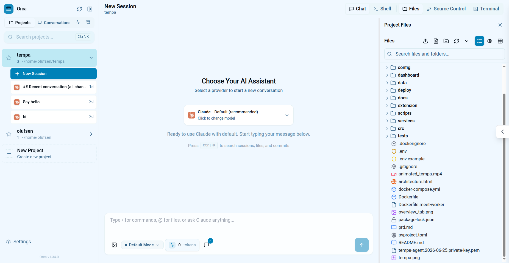

<div align="center">

# Orca

**A polished, self-hosted web IDE for [Claude Code](https://docs.anthropic.com/en/docs/claude-code) CLI**

Refined UI/UX · Navy + ice theming · Deep appearance customization · Local-first

<br />

[](LICENSE)
[](https://nodejs.org/)
[](https://www.npmjs.com/package/@orca-ai/orca)
[](https://github.com/siteboon/claudecodeui)

<br />

[Quick start](#quick-start) · [Features](#features) · [Why Orca?](#why-orca) · [Configuration](#configuration) · [License](#license)

<br />



*Orca — intelligent coding interface for Claude Code*

</div>

---

## Table of contents

- [About](#about)
- [Why Orca?](#why-orca)
- [Features](#features)
- [Quick start](#quick-start)
- [Production](#production)
- [Configuration](#configuration)
- [CLI](#cli)
- [Desktop](#desktop)
- [Theming & appearance](#theming--appearance)
- [Fork & attribution](#fork--attribution)
- [License](#license)

---

## About

**Orca** is a community fork of [CloudCLI UI](https://github.com/siteboon/claudecodeui) (formerly *claudecodeui*).

It inherits the same browser-based IDE foundation — chat, terminal, files, git, MCP, plugins, TaskMaster, and browser automation — and builds on it with a **Claude-first focus**, a **more polished interface**, and **richer customization**.

> **Choose Orca** if you run Claude Code locally or on your own server and want a refined, customizable UI without juggling multiple agent CLIs.
>
> **Choose upstream** if you need Cursor, Codex, Gemini, or OpenCode in the same app, or prefer the managed [CloudCLI Cloud](https://cloudcli.ai) offering.

---

## Why Orca?

| Area | Upstream (CloudCLI UI) | Orca |
| :--- | :--------------------- | :--- |
| **Focus** | Multi-provider (Claude, Cursor, Codex, Gemini, OpenCode) | **Claude Code CLI** by default — simpler UI, fewer providers to configure |
| **UI & UX** | Functional, provider-centric layout | **Refined interface** — cleaner navigation, guided onboarding, command palette, cohesive navy + ice design |
| **Onboarding** | Basic setup | Guided wizard: git, Claude login, project discovery, MCP intro, power features, and a **health check** |
| **Skills** | Upload and manage per project | Same, plus a built-in **skills marketplace** to browse and install curated skills |
| **Claude Config** | MCP and permissions via settings | Dedicated editor for **CLAUDE.md**, hooks, memory, skills, agents, and rules |
| **Tasks** | TaskMaster kanban | TaskMaster plus **one-click “implement in chat”** from the board |
| **Theming** | Standard light/dark | **Orca**, Classic, Slate presets + **custom palette editor** — light/dark toggled independently |
| **Appearance** | Limited | Full **Settings → Appearance**: themes, language, project sort, code editor options |
| **Desktop** | Web only | Optional **Electron** app |
| **Self-hosting** | Open source, oriented toward CloudCLI Cloud | **Local-first** — no cloud upsell, optional auth for LAN/remote |
| **Data** | `~/.cloudcli` | `~/.orca/` with automatic migration from legacy paths |

---

## Features

<table>
<tr>
<td width="50%" valign="top">

<h3>Core workspace</h3>
<ul>
<li><strong>Chat</strong> — streaming sessions, tool rendering, subagents, plan mode, permissions</li>
<li><strong>Terminal</strong> — integrated PTY shell per project</li>
<li><strong>File tree &amp; editor</strong> — browse, edit, upload, and create files</li>
<li><strong>Git panel</strong> — diffs, commits (AI message generation), branches, push/pull</li>
<li><strong>Command palette</strong> — <kbd>⌘K</kbd> / <kbd>Ctrl+K</kbd> to jump anywhere</li>
</ul>

</td>
<td width="50%" valign="top">

<h3>Claude &amp; automation</h3>
<ul>
<li><strong>Claude Config</strong> — CLAUDE.md, hooks, memory, skills, agents, rules</li>
<li><strong>MCP management</strong> — add and configure Model Context Protocol servers</li>
<li><strong>Task board</strong> — TaskMaster kanban (Settings → Tasks)</li>
<li><strong>Browser automation</strong> — agent-driven and manual URL sessions (Settings → Browser)</li>
<li><strong>Skills marketplace</strong> — browse and install curated skills</li>
</ul>

</td>
</tr>
<tr>
<td width="50%" valign="top">

<h3>Customization</h3>
<ul>
<li><strong>Color themes</strong> — Orca, Classic, Slate, or fully custom palettes</li>
<li><strong>Appearance settings</strong> — code editor theme, font size, word wrap, minimap, line numbers</li>
<li><strong>Light / dark mode</strong> — independent of color theme</li>
<li><strong>i18n</strong> — 10+ locales</li>
</ul>

</td>
<td width="50%" valign="top">

<h3>Platform</h3>
<ul>
<li><strong>Plugins</strong> — tab-slot extensions under <code>~/.orca/plugins/</code></li>
<li><strong>Notifications</strong> — in-app, sound, and web push</li>
<li><strong>Session tools</strong> — export to markdown, fork from the sidebar</li>
<li><strong>Auth</strong> — optional login for network exposure (<code>DISABLE_AUTH=false</code>)</li>
</ul>

</td>
</tr>
</table>

---

## Quick start

**Requirements:** [Node.js 22+](https://nodejs.org/) · [Claude Code CLI](https://docs.anthropic.com/en/docs/claude-code) installed and authenticated

```bash
git clone https://github.com/YOUR_USER/orca.git
cd orca
npm install
npm run dev
```

| Service | URL |
| :------ | :-- |
| Frontend | `http://localhost:5173` |
| API | `http://localhost:3001` |

---

## Production

```bash
npm run build
npm run server
```

Or install globally:

```bash
npm install -g @orca-ai/orca
orca
```

---

## Configuration

Copy `.env.example` to `.env` and adjust as needed.

| Setting | Default | Description |
| :------ | :------ | :---------- |
| Data directory | `~/.orca/` | Auth DB, plugins, browser profiles |
| Legacy migration | automatic | Migrates from `~/.cloudcli` and `~/.claude-code-ui` on first boot |

<details>
<summary><strong>Network / LAN access</strong></summary>

<br />

Set both variables, then create an account on first launch:

```env
DISABLE_AUTH=false
VITE_DISABLE_AUTH=false
```

</details>

<details>
<summary><strong>About tab & GitHub star badge</strong></summary>

<br />

```env
VITE_GITHUB_OWNER=your-username
VITE_GITHUB_REPO=orca
```

</details>

---

## CLI

| Command | Description |
| :------ | :---------- |
| `orca` | Start the server |
| `orca status` | Show config and data paths |
| `orca help` | Show all options |

---

## Desktop

```bash
npm run desktop:dev   # dev: run npm run dev in another terminal first
npm run desktop:pack  # build + unpackaged Electron app
```

---

## Theming & appearance

Open **Settings → Appearance**:

| Option | Details |
| :----- | :------ |
| **Color theme** | Orca (default), Classic, Slate, or custom palette with per-token color pickers |
| **Dark mode** | Toggled independently of the color theme |
| **Code editor** | Theme, font size, word wrap, minimap, line numbers |
| **Language** | 10+ locales |
| **Project sorting** | Alphabetical or by recent activity |

---

## Fork & attribution

Orca is derived from [CloudCLI UI](https://github.com/siteboon/claudecodeui) by Siteboon AI B.V. and contributors.

See [NOTICE](NOTICE) for upstream copyright and license attribution.

---

<div align="center">

## License

[AGPL-3.0-or-later](LICENSE) · See [NOTICE](NOTICE) for upstream attribution

<br />

**Made for the Claude Code community**

</div>
